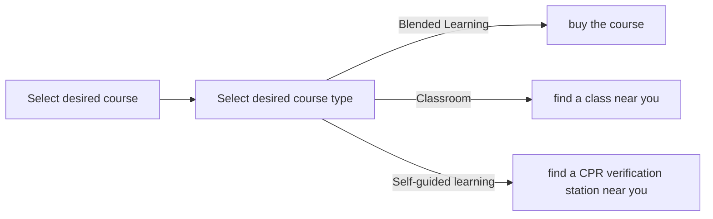
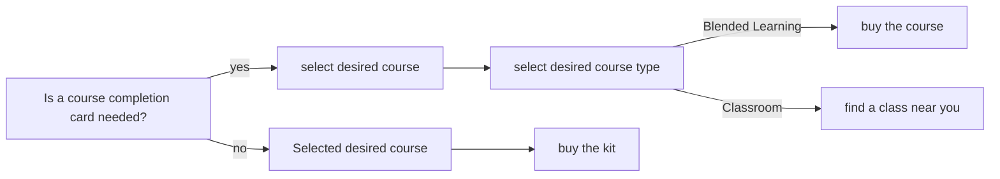

# How to register for a Certification course
Once all courses have been reviewed and future course participants have identified the specific certification that they require, they will need to register for the course. The charts below offer instruction for how to register depending on the desired class.

### Registration for [Healthcare Professionals](https://cpr.heart.org/en/course-catalog-search) 

### Registration for [non-Healthcare Professionals](https://cpr.heart.org/en/course-catalog-search)

